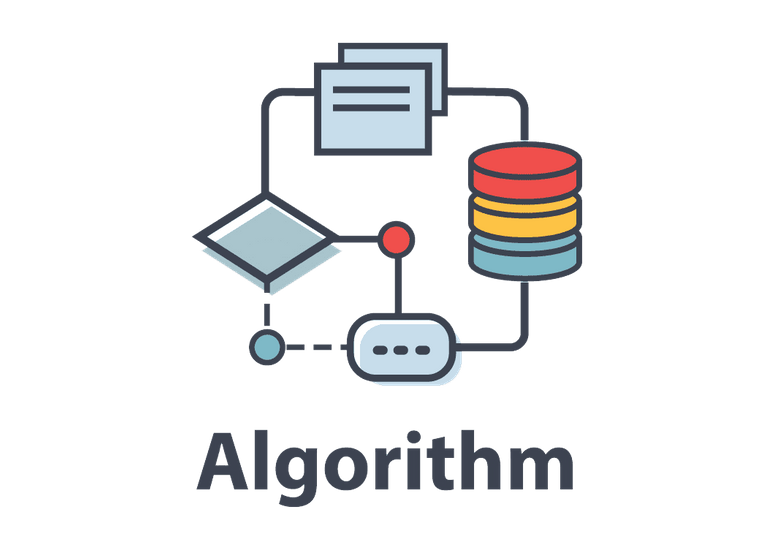

   
  
   
  <h2>알고리즘 문제 풀이 with JavaScript</h2>
   

🎯 `한달에 10문제 이상`을 푸는 것을 목표로 합니다.

## 📅 문제 풀이 진행

### 2024년 10월

|   날짜    | 유형 |   난이도   |              문제              |               나의 풀이                | 풀이 결과 | 추가 학습 |
| :-------: | :--: | :--------: | :----------------------------: | :------------------------------------: | :-------: | :-------: |
| 24.10.08. |  DP  | `sliver 3` |   [피보나치 함수][fibo-func]   |    [풀이 내용 링크][fibo-func-sol]     |    ✅     |    ✅     |
| 24.10.08. |  DP  | `sliver 3` |      [01타일][fibo-func]       |     [풀이 내용 링크][01-tile-sol]      |    ✅     |    ✅     |
| 24.10.08. |  DP  | `sliver 1` |   [포도주시식][wine-tasting]   |   [풀이 내용 링크][wine-tasting-sol]   |    ✅     |    ❌     |
| 24.10.08. |  DP  | `sliver 3` |      [01타일][fibo-func]       |     [풀이 내용 링크][01-tile-sol]      |    ✅     |    ✅     |
| 24.10.08. |  DP  | `sliver 3` | [파도반수열][padoban-sequence] | [풀이 내용 링크][padoban-sequence-sol] |    ✅     |           |

### 2024년 09월

|   날짜    |   유형   |  난이도   |                        문제                         |                    나의 풀이                     | 풀이 결과 | 추가 학습 |
| :-------: | :------: | :-------: | :-------------------------------------------------: | :----------------------------------------------: | :-------: | :-------: |
| 24.09.17. | 큐/스택  | `Level 2` |                [기능 개발][func-dev]                |          [풀이 내용 링크][func-dev-sol]          |    🚸     |    ✅     |
| 24.09.17. | 큐/스택  | `Level 2` |              [주식 가격][stock-price]               |        [풀이 내용 링크][stock-price-sol]         |    ✅     |    ✅     |
| 24.09.17. | 큐/스택  | `Level 2` |         [다리를 지나는 트럭][truck-bridge]          |        [풀이 내용 링크][truck-bridge-sol]        |    🚸     |    ❌     |
| 24.09.18. | 큐/스택  | `Level 1` |           [올바른 괄호][correct-brackets]           |      [풀이 내용 링크][correct-brackets-sol]      |    ✅     |    ❌     |
| 24.09.18. | 큐/스택  | `Level 2` |          [괄호 회전하기][rotate-brackets]           |      [풀이 내용 링크][rotate-brackets-sol]       |    🚸     |    ❌     |
| 24.09.18. |  그리디  | `Level 3` |              [숫자 게임][number-game]               |        [풀이 내용 링크][number-game-sol]         |    🚸     |    ✅     |
| 24.09.19. |    DP    | `Level 3` |        [스티커 모으기][sticker-collection-2]        |    [풀이 내용 링크][sticker-collection-2-sol]    |    ❌     |    ✅     |
| 24.09.19. |   구현   | `Level 2` |       [주차 요금 계산][calculate-parking-fee]       |   [풀이 내용 링크][calculate-parking-fee-sol]    |    ✅     |    ❌     |
| 24.09.20. |   구현   | `Level 2` |     [행렬 테두리 회전하기][rotate-matrix-edge]      |     [풀이 내용 링크][rotate-matrix-edge-sol]     |    ✅     |    ❌     |
| 24.09.20. |   탐색   | `Level 2` | [연속된 부분 수열의 합][sum-of-contiguous-sequence] | [풀이 내용 링크][sum-of-contiguous-sequence-sol] |    🚸     |    ❌     |
| 24.09.21. |  그래프  | `Level 3` |                    [순위][rank]                     |            [풀이 내용 링크][rank-sol]            |    ❌     |    ❌     |
| 24.09.22. | 백트랙킹 | `Level 3` |                                                     |                                                  |    ❌     |    ❌     |
| 24.09.22. | 백트랙킹 | `Level 2` |                 [피로도][tiredness]                 |            [풀이 내용 링크][rank-sol]            |    ❌     |    ❌     |
| 24.09.22. | 백트랙킹 | `Level 2` |                [양궁대회][tiredness]                |            [풀이 내용 링크][rank-sol]            |    ❌     |    ❌     |

[//]: # 'URL 변수 정의 - 24년 10월'
[fibo-func]: https://www.acmicpc.net/problem/1003
[fibo-func-sol]: https://github.com/candymask0712/algorithm-with-js/blob/main/DP/fast-dp-01/beak_s3_1003_fibonacci-func.js
[01-tile]: https://www.acmicpc.net/problem/1904
[01-tile-sol]: https://github.com/candymask0712/algorithm-with-js/blob/main/DP/fast-dp-01/beak_s3_1904_01-tile.js
[wine-tasting]: https://www.acmicpc.net/problem/1904
[wine-tasting-sol]: https://github.com/candymask0712/algorithm-with-js/blob/main/DP/fast-dp-01/beak_s1_2156_wine-tasting.js
[padoban-sequence]: https://www.acmicpc.net/problem/1904
[padoban-sequence-sol]: https://github.com/candymask0712/algorithm-with-js/blob/main/DP/fast-dp-01/beak_s3_9461_padoban-sequence.js
[//]: # 'URL 변수 정의 - 24년 09월'
[func-dev]: https://school.programmers.co.kr/learn/courses/30/lessons/42586
[func-dev-sol]: https://github.com/candymask0712/algorithm-with-js/blob/main/Stack%26Queue/Queue/pro_lv2_function-development.js
[stock-price]: https://school.programmers.co.kr/learn/courses/30/lessons/42584
[stock-price-sol]: https://github.com/candymask0712/algorithm-with-js/blob/main/Stack%26Queue/Queue/pro_lv2_stock-price.js
[truck-bridge]: https://school.programmers.co.kr/learn/courses/30/lessons/42583
[truck-bridge-sol]: https://github.com/candymask0712/algorithm-with-js/blob/main/Stack%26Queue/Queue/pro_lv2_trucks-crossing-bridge.js
[correct-brackets]: https://school.programmers.co.kr/learn/courses/30/lessons/12909
[correct-brackets-sol]: https://github.com/candymask0712/algorithm-with-js/blob/main/Stack%26Queue/Stack/pro_lv1_correct-brackets.js
[rotate-brackets]: https://school.programmers.co.kr/learn/courses/30/lessons/76502
[rotate-brackets-sol]: https://github.com/candymask0712/algorithm-with-js/blob/main/Stack%26Queue/Stack/pro_lv2_rotate-brackets.js
[number-game]: https://school.programmers.co.kr/learn/courses/30/lessons/12987
[number-game-sol]: https://github.com/candymask0712/algorithm-with-js/blob/main/greedy/pro_lv3_number-game.js
[sticker-collection-2]: https://school.programmers.co.kr/learn/courses/30/lessons/12971#
[sticker-collection-2-sol]: https://github.com/candymask0712/algorithm-with-js/blob/main/DP/pro_lv3_sticker-collection-2.js
[calculate-parking-fee]: https://school.programmers.co.kr/learn/courses/30/lessons/92341
[calculate-parking-fee-sol]: https://github.com/candymask0712/algorithm-with-js/blob/main/Implementation/pro_lv2_calculate_parking_fee.js
[rotate-matrix-edge]: https://school.programmers.co.kr/learn/courses/30/lessons/77485
[rotate-matrix-edge-sol]: https://github.com/candymask0712/algorithm-with-js/blob/main/Implementation/pro_lv2_rotate-matrix-edge.js
[sum-of-contiguous-sequence]: https://school.programmers.co.kr/learn/courses/30/lessons/77485
[sum-of-contiguous-sequence-sol]: https://github.com/candymask0712/algorithm-with-js/blob/main/Search%26Traversal/Search/Two-Pointer/Pro_lv2_sum-of-contiguous-sequence.js
[rank]: https://school.programmers.co.kr/learn/courses/30/lessons/49191
[rank-sol]: https://github.com/candymask0712/algorithm-with-js/blob/main/Search%26Traversal/Search/Two-Pointer/Pro_lv2_sum-of-contiguous-sequence.js
[n-queen]: https://school.programmers.co.kr/learn/courses/30/lessons/49191
[n-queen-sol]: https://github.com/candymask0712/algorithm-with-js/blob/main/Search%26Traversal/Search/Two-Pointer/Pro_lv2_sum-of-contiguous-sequence.js
[tiredness]: https://school.programmers.co.kr/learn/courses/30/lessons/87946?language=javascript
[tiredness-sol]: https://github.com/candymask0712/algorithm-with-js/blob/main/Search%26Traversal/Search/Two-Pointer/Pro_lv2_sum-of-contiguous-sequence.js
[archery-competition]: https://school.programmers.co.kr/learn/courses/30/lessons/87946?language=javascript
[archery-competition-sol]: https://github.com/candymask0712/algorithm-with-js/blob/main/Search%26Traversal/Search/Two-Pointer/pro_lv2_archery_competition
